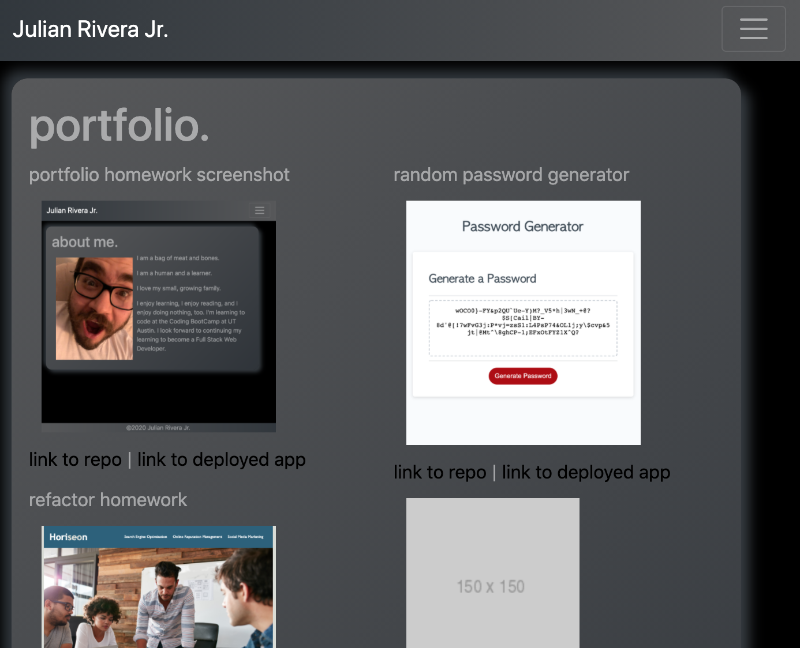
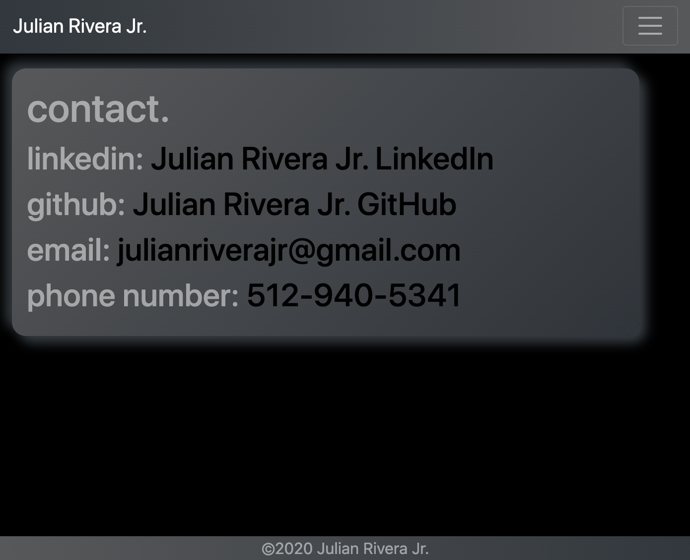

# Mobile-First Responsive-Portfolio

## Objective

I have created a website with a responsive navigation bar, a responsive layout, and responsive images; that is, they have to adjust to different screen sizes. This website serves as my personal site, with an "about me" section, a "portfolio" section showing my best work, and a "contact" section in which folks can choose how they want to get in contact with me.

## Screenshots

## Technologies Used
* HTML

## Links
* Link to GitHub Repo https://github.com/julianriverajr/Homework-2-Responsive-Portfolio
* Link to WebPage https://julianriverajr.github.io/Homework-2-Responsive-Portfolio/index.html

### Contact Info
email: julianriverajr@gmail.com
